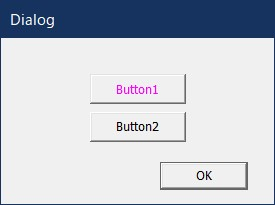
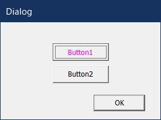
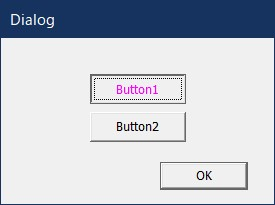

# ボタンのキャプションの色を変更する Button with customized font.
目次 Contents
<!-- TOC -->

- [ボタンのキャプションの色を変更する Button with customized font.](#ボタンのキャプションの色を変更する-button-with-customized-font)
  - [概要 Overview](#概要-overview)
  - [開発環境 Development Environment](#開発環境-development-environment)
  - [ライセンス License](#ライセンス-license)
  - [実行サンプル Sample Image](#実行サンプル-sample-image)
  - [Link](#link)
  - [Z1000R](#z1000r)

<!-- /TOC -->

## 概要 Overview
オーナードローを使って、ボタンの文字の色を変更します。

## 開発環境 Development Environment
- Windows 10 Home 64bit  
- Visual Studio 2019  
- Visual C++  

## ライセンス License
- MIT License  

## 実行サンプル Sample Image
通常状態  
  
フォーカスがある状態  
  
フォーカスがあり、押し込まれた状態  
  
## Link
[はてなブログ](https://z1000s.hatenablog.com/)  

## Z1000R
Twitter : @Z1000R_LR  
[Blog](https://z1000s.hatenablog.com/)  